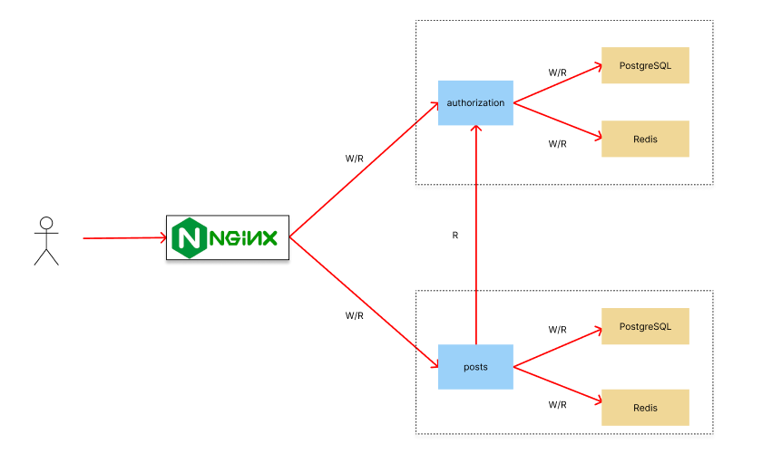
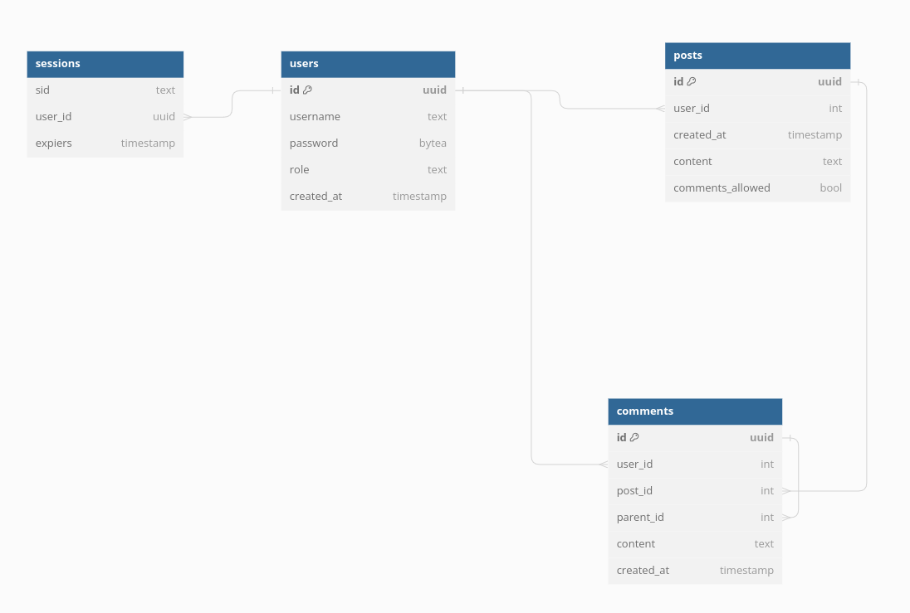
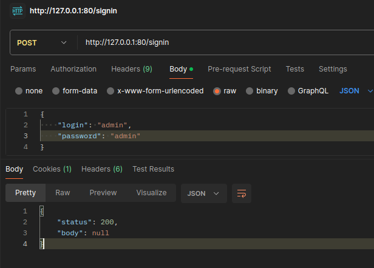
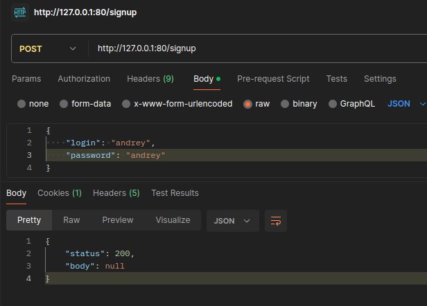
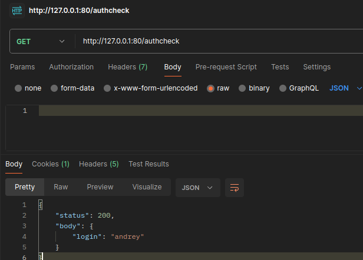
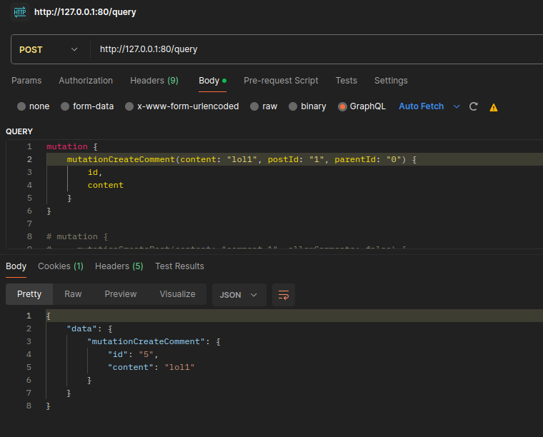
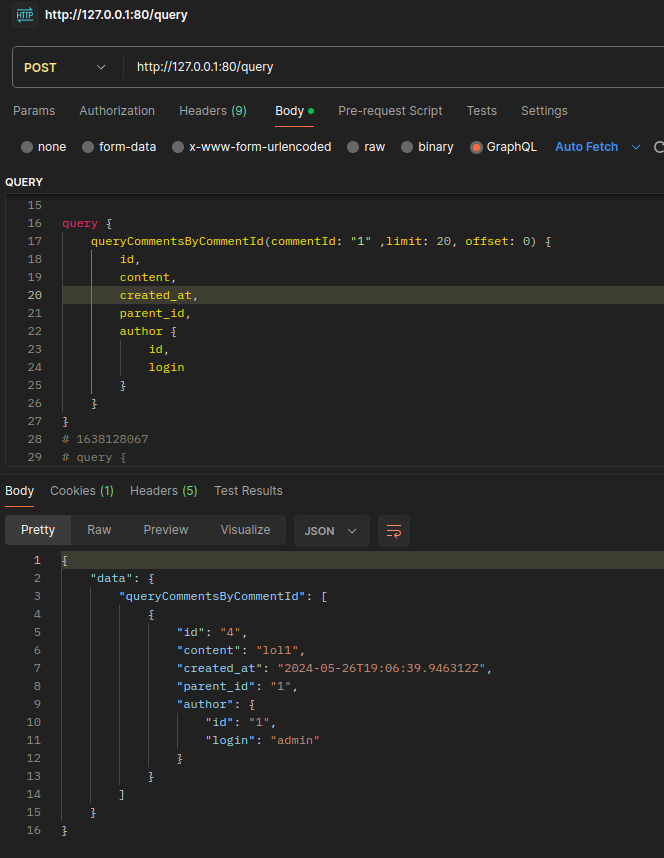
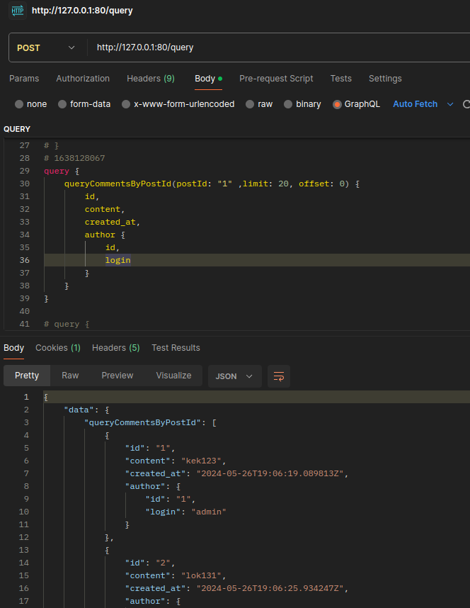
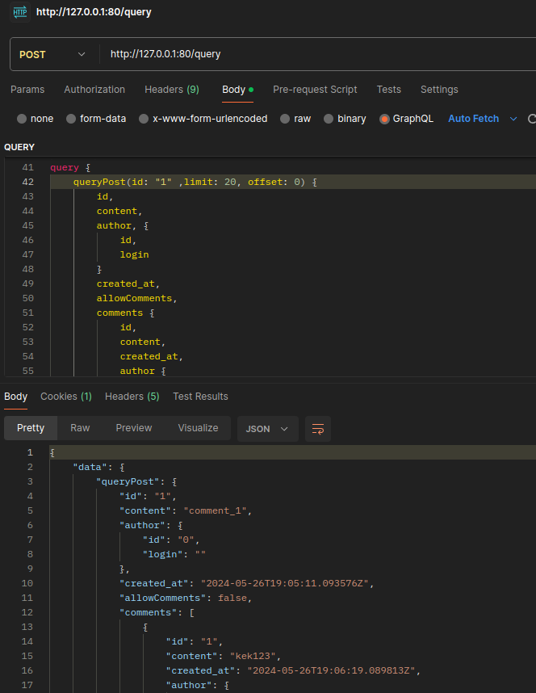
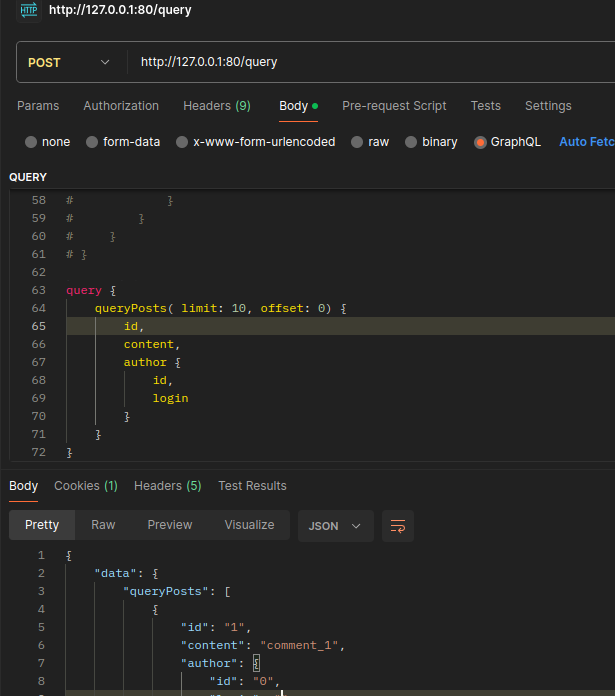

# ozon-test

#### Приложение запускается одной из следующих команд.
Эта команда запускает приложение по умолчанию (БД postgresql)
```
make up
```

Эта команда запускает приложение с БД redis
```
make redis
```

Эта команда запускает приложение с БД postgresql
```
make postgresql
```

### Описание проекта
Приложение микросервисное, общение между сервисами происходит по GRPC API. 

Присутствуют 2 сервиса: авторизации и постов. В сервисах реализована Чистая архитектура. Оба сервиса stateless.

Общение между браузером и сервисом авторизации происходит по REST API.

Общение между браузером и сервисом постов происходит через GraphQL.

Api отвечает за обработку запросов, usecase за бизнес логику, repo за работу с БД. 

Также присутствует контейнер c Nginx.

Реализована statefull авторизация. Для системы авторизации и сохранения сессий была выбрана бд кэширования Redis. 

Для получения данных пользователя была выбрана бд PostgreSQL.

В сервисе постов есть возможность выбора БД - Redis или PostgreSQL

### Реализованные требования.
 * Просмотр списка постов
 * Просмотр поста и комментариев к нему
 * Автор поста может запретить оставление комментариев к своему посту
 * Комментарии организованы иерархически
 * Система написана на языке Go
 * Система развертывается через docker compose и docker
 * Хранение постов и комментариев может быть как в Redis (in-memory), так и Postgresql.

### Схема проекта


### Схема БД


### Примеры запросов для сервиса авторизации.
##### /signin
Авторизация <br/>


##### /signup 
Регистрация <br/>


##### /authcheck
Аутентификация <br/>


##### /logout
Выход <br/>


### Примеры запросов для сервиса постов.
#### /query
mutationCreatePost <br/>


mutationCreateComment <br/>


queryCommentsByCommentId <br/>


queryCommentsByPostId <br/>


queryPost <br/>


queryPosts <br/>

