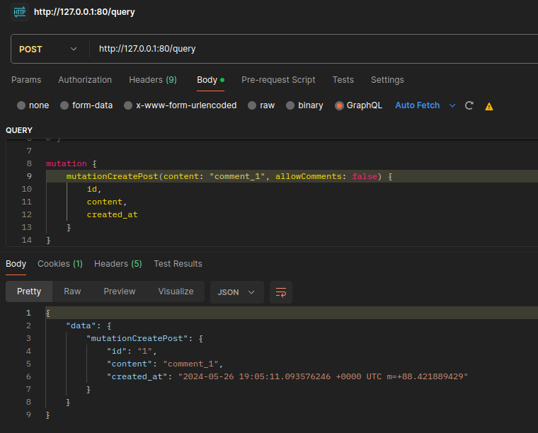

# ozon-test

#### Приложение запускается одной из следующих команд.
Эта команда запускает приложение по умолчанию (БД postgresql)
```
make up
```

Эта команда запускает приложение с БД redis
```
make redis
```

Эта команда запускает приложение с БД postgresql
```
make postgresql
```


Приложение микросервисное, общение между сервисами происходит по GRPC API. 

Присутствуют 2 сервиса: авторизации и постов. В сервисах реализована Чистая архитектура.

Общение между браузером и сервисом авторизации происходит по REST API.

Общение между браузером и сервисом постов происходит через GraphQL.

Api отвечает за обработку запросов, usecase за бизнес логику, repo за работу с БД. 

Также присутствует контейнер c Nginx.

Для системы авторизации и сохранения сессий была выбрана бд кэширования Redis. 

Для получения данных пользователя была выбрана бд PostgreSQL.

В сервисе постов есть возможность выбора БД - Redis или PostgreSQL

### Схема проекта


### Схема БД


### Примеры запросов.